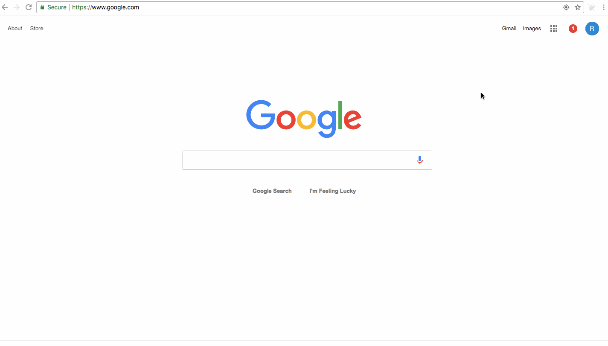

# CashBackR

## What is it?
It's a button that links you to ebates if a site is cash-back eligible.

It's inspired by the ebates cash back button, however, Ebates' button may phone home
after spying on your page visits. This is stated in Ebates' cash back
button terms of use.

## How does it work?
The extension keeps a well-known list of cashback eligible sites to avoid
asking whether a site is ebates eligible.

It looks at your current tab's URL and if it's cashback eligible, the
flying money logo will become clickable and link you to Ebates' store link.

## Demo

## Future ideas
1. integrate with more than just ebates
2. start an ebates shopping session instead of linking to ebates to manually start one
