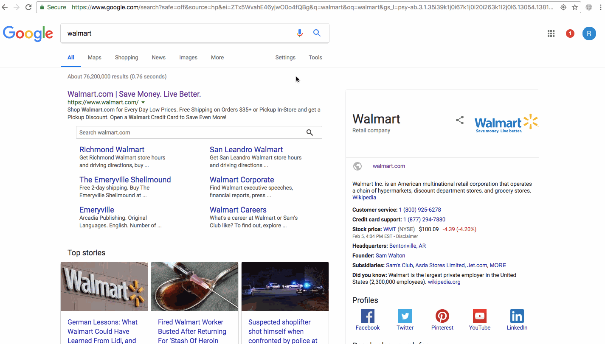

# CashBackR
https://chrome.google.com/webstore/detail/cashbackr/mmnmabnpkbjiehgagfdimcoiojicedoo

## What is it?
It's a button that links you to ebates if a site is cash-back eligible.

It's inspired by the ebates cash back button, however, Ebates' button may phone home
after spying on your page visits. This is stated in Ebates' cash back
button terms of use.

## How does it work?
The extension keeps a well-known list of cashback eligible sites to avoid
asking whether a site is ebates eligible.

It looks at your current tab's URL and if it's cashback eligible, the
flying money logo will become clickable and link you to Ebates' store link.

## Demo
1. Navigate to an ebates eligible ecommerce site (like target.com)
2. The flying cash icon to the right of the chrome omnibar will become clickable
3. Click into it to open a new ebates tab
4. Start your shopping trip from ebates

## FAQs

**Q:** *Why does CashBackR request permission to read my browsing history?*  
**A:** CashBackR checks the active tab's URL for cashback eligibility. While CashBackR has the permission to read 
browsing history, it only reads the active tab's URL. Chrome does not offer a finer permission to only view the active 
tab's URL. This is verifiable in the [source code](https://github.com/rcarino/cashbackr).

**Q:** *Why should I use CashBackR instead of Ebates' first party Cash Back Button?*
**A:** According to Ebates' 
[terms of service](https://www.ebates.com/help/article/ebates-cash-back-shopping-program-terms-115013182127#browser-terms), 
section 5.5.2, installing the Cash Back Button allows Ebates to record visited URLs and page content. 
Furthermore, Ebates is allowed to sell this tracked info on an aggregated and anonymized basis. In contrast, 
CashBackR has no tracking and is completely offline. It simply checks whether the current tab's URL is in a hard-coded 
list of cashback merchants.

## Future ideas
1. integrate with more than just ebates
2. start an ebates shopping session instead of linking to ebates to manually start one
